# Chillight Graph

<p align="center">
  
</p>

<p align="center">
A beautiful animated Graph View plugin for Obsidian with glowing themed nodes, curved garland-style wires, customizable colors, and decorative visual effects.
</p>

<p align="center">
  
  
  
</p>

<p align="center">
  <a href="https://vanyasatanic.donatik.ua/">
    
  </a>
</p>

---

## ✨ Features

- 🎨 14 built-in visual themes
- 🌈 Multiple animation modes
- 💡 Glowing animated nodes
- 🔌 Curved garland-style wires
- 🎨 Custom wire color
- 📏 Custom wire thickness
- ✨ Custom wire glow
- 🌊 Custom wire sag
- 🔴 Custom node size
- 💫 Custom node glow
- 📝 Custom node text color
- ⚡ Lightweight and fun
- 🖥 Desktop only

---

## 🎨 Themes

### 🎄 Christmas Garland

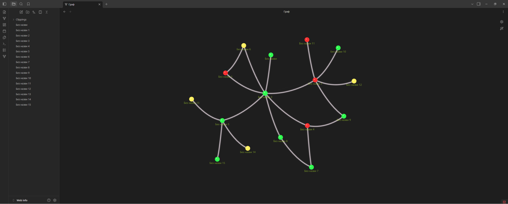

### 🌸 Sakura Flowers

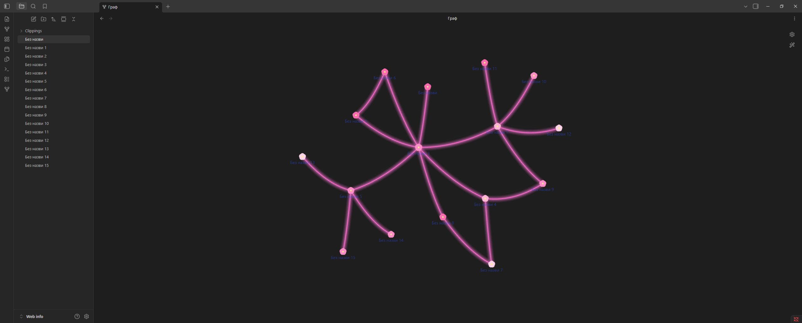

### ☁️ Pink Clouds

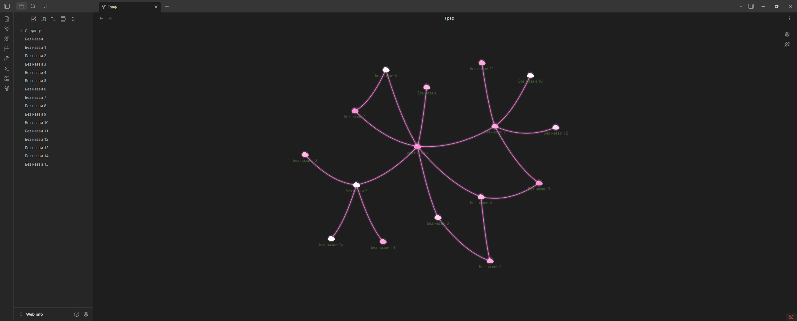

### ✨ Golden Lights

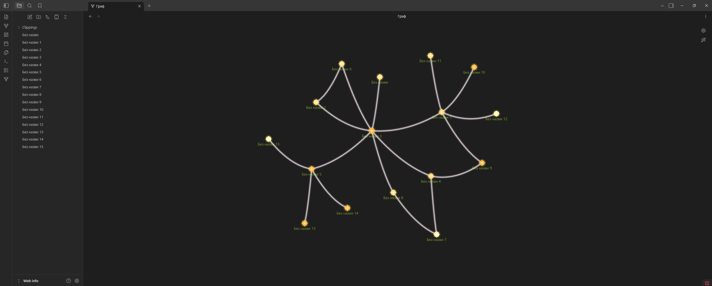

### 💜 Neon Spheres

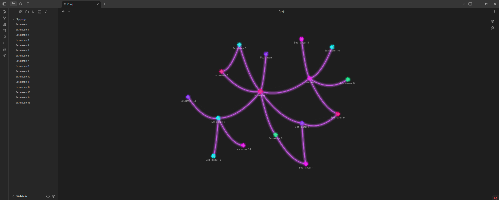

### ❄️ Snow

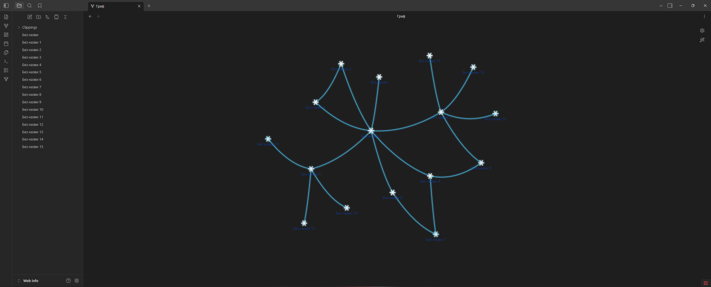

### ⭐ Stars

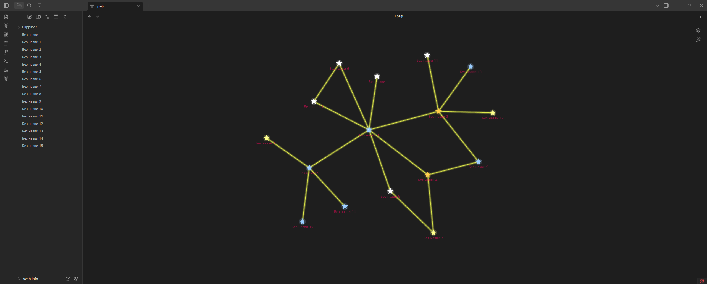

### 🌿 Vines

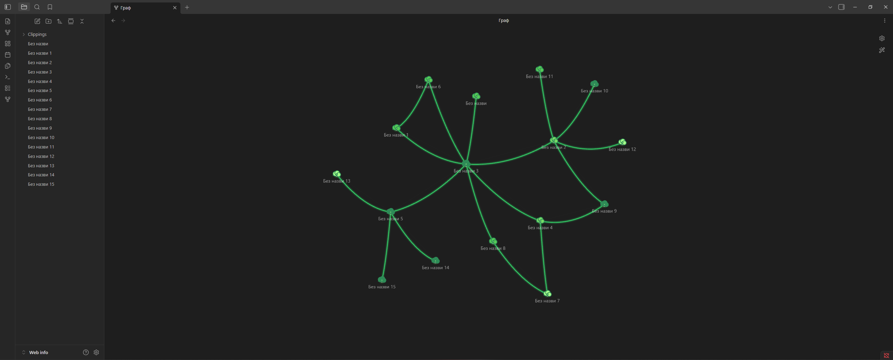

### 🍄 Mushrooms

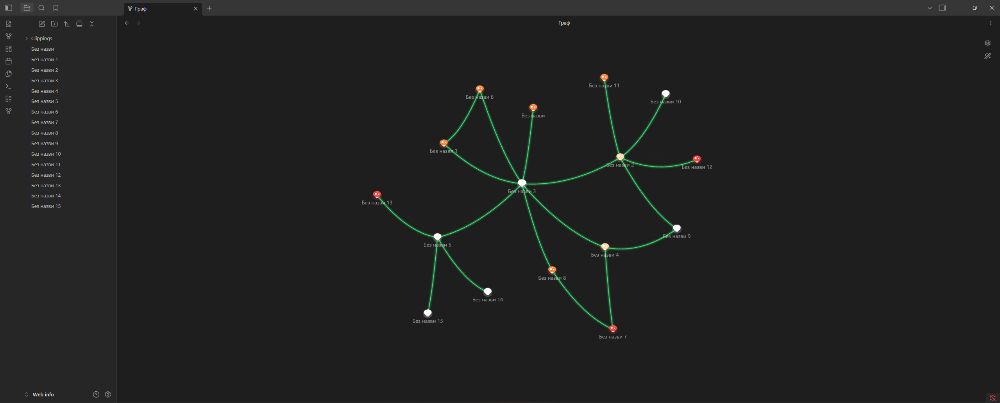

### 🪐 Planets

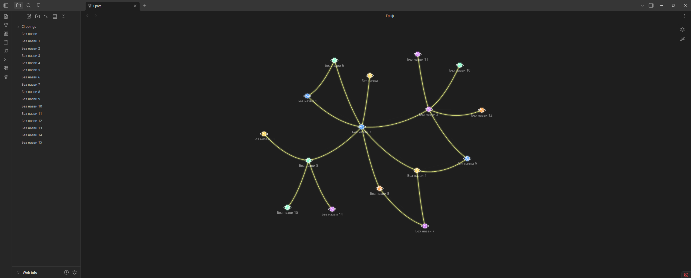

### 🌙 Moon

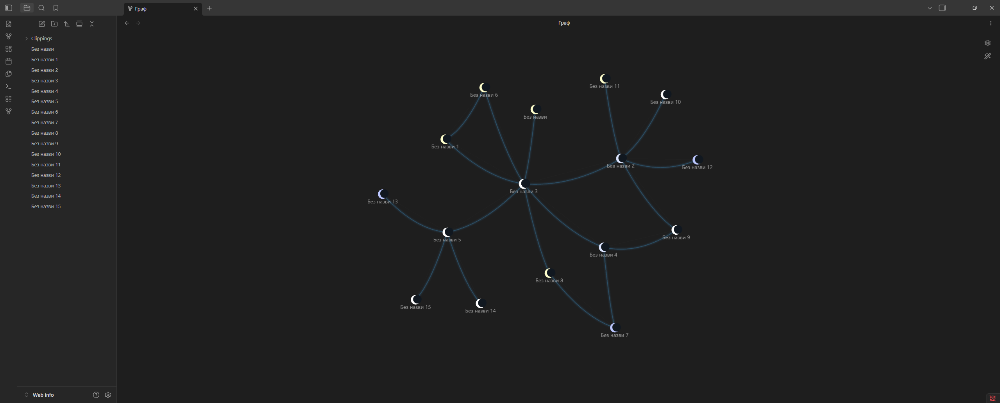

### 💧 Water

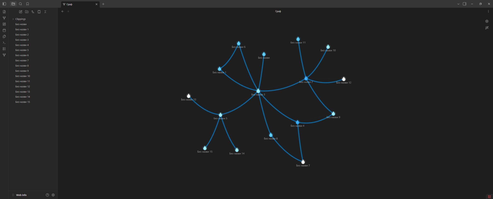

### 🦋 Butterflies

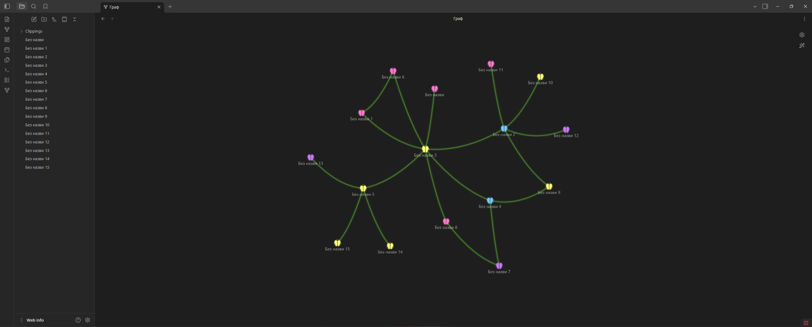

### ⚡ Energy

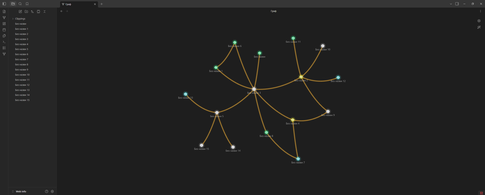

---

## ⚙️ Settings

### Appearance

- Theme
- Animation mode
- Node size
- Node glow
- Node text color

### Wires

- Show / hide custom wires
- Wire color
- Wire thickness
- Wire glow
- Wire sag

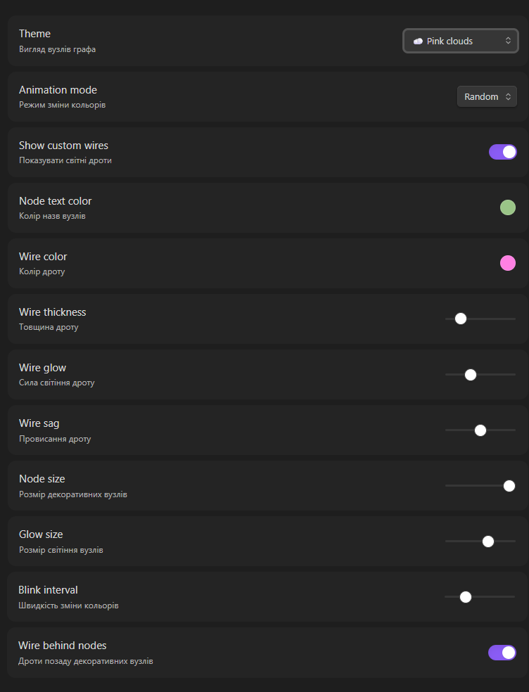

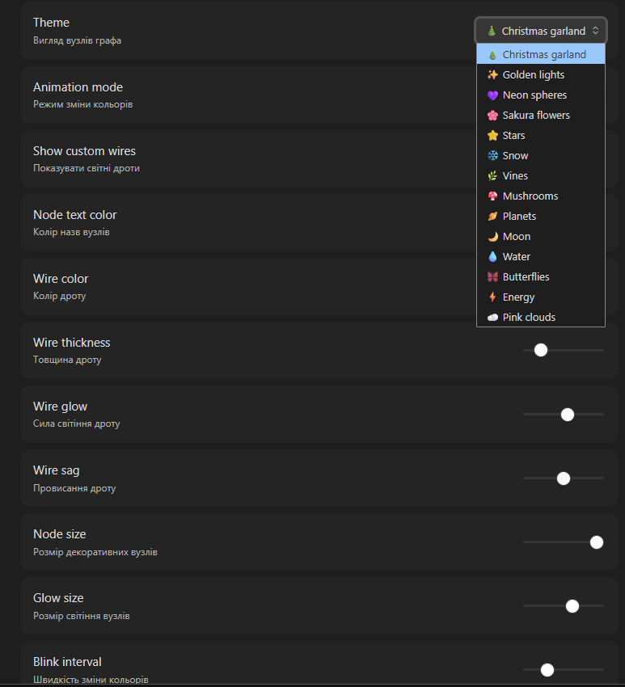

---

## 🌈 Animation Modes

- 🎲 Random
- 🌊 Wave
- 🌈 Rainbow
- 💓 Pulse
- ⏸ Static

---

## 📦 Installation

### Community Plugins

Coming soon.

### Manual installation

Download the latest release and copy these files into:

```text
Vault/.obsidian/plugins/chillight-graph/
```

Required files:

```text
main.js
manifest.json
styles.css
```

Then restart Obsidian and enable **Chillight Graph** in:

```text
Settings → Community Plugins
```

---

## 🛠 Development

```bash
git clone https://github.com/irolyuk/chillight-graph.git
cd chillight-graph
npm install
npm run dev
```

Production build:

```bash
npm run build
```

---

## ❤️ Support Development

If you like Chillight Graph and want to support future updates, you can donate here:

<p align="center">
  <a href="https://vanyasatanic.donatik.ua/">
    
  </a>
</p>

---

## 🚀 Roadmap

- More themes
- Theme presets
- Import / export presets
- Animated theme effects
- More wire styles
- Better glow rendering
- Community Plugin release

---

## 📄 License

MIT License

---

<p align="center">
Made with ❤️ for the Obsidian community.
</p>